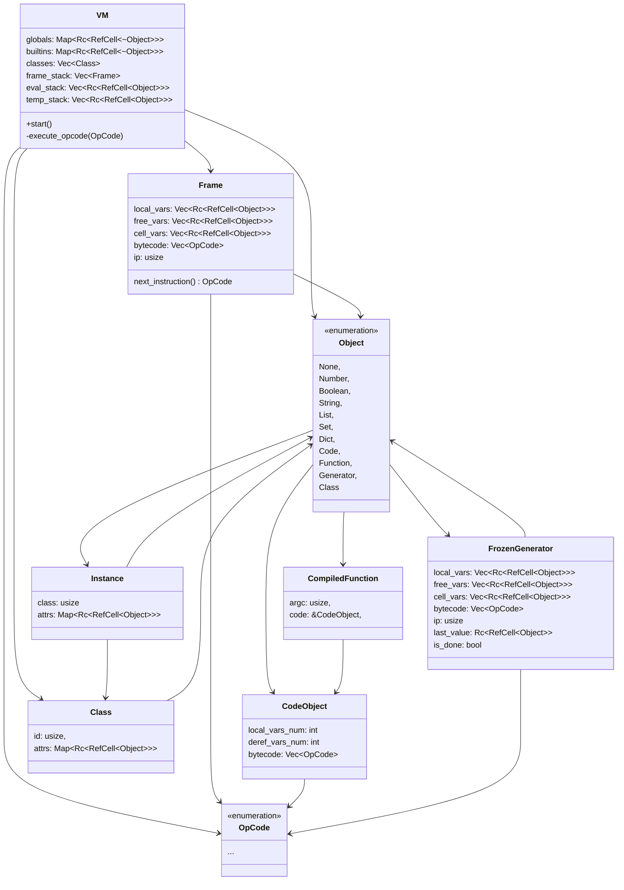

```mermaid
---
config:
  layout: dagre
---
classDiagram
    class VM {
        globals: Map~Rc~RefCell~~Object~~~
        builtins: Map~Rc~RefCell~~Object~~~
        classes: Vec~Class~
        frame_stack: Vec~Frame~
        eval_stack: Vec~Rc~RefCell~Object~~~
        temp_stack: Vec~Rc~RefCell~Object~~~
        +start()
        -execute_opcode(OpCode)
    }
    class Frame {
        local_vars: Vec~Rc~RefCell~Object~~~
        free_vars: Vec~Rc~RefCell~Object~~~
        cell_vars: Vec~Rc~RefCell~Object~~~
        bytecode: Vec~OpCode~
        ip: usize
        next_instruction() OpCode
    }
    class OpCode {
        <<enumeration>>
        ...
    }
    class Object {
        <<enumeration>>
        None,
        Number,
        Boolean,
        String,
        List,
        Set,
        Dict,
        Code,
        Function,
        Generator,
        Class
    }
    class CodeObject {
        local_vars_num: int
        deref_vars_num: int
        bytecode: Vec~OpCode~
    }
    class CompiledFunction {
        argc: usize,
        code: &CodeObject,
    }
    class FrozenGenerator {
        local_vars: Vec~Rc~RefCell~Object~~~
        free_vars: Vec~Rc~RefCell~Object~~~
        cell_vars: Vec~Rc~RefCell~Object~~~
        bytecode: Vec~OpCode~
        ip: usize

        last_value: Rc~RefCell~Object~~
        is_done: bool
    }
    class Instance {
        class: usize
        attrs: Map~Rc~RefCell~Object~~~
    }
    class Class {
        id: usize,
        attrs: Map~Rc~RefCell~Object~~~
    }

    VM --> Frame
    VM --> Object
    VM --> Class
    VM --> OpCode
    Frame --> Object
    Frame --> OpCode

    Object --> Instance
    Object --> CodeObject
    Object --> CompiledFunction
    Object --> FrozenGenerator
    CodeObject --> OpCode
    CompiledFunction --> CodeObject
    FrozenGenerator --> Object
    FrozenGenerator --> OpCode
    Instance --> Class
    Instance --> Object
    Class --> Object
```

Bytecode instruction set is defined in [bytecode.rs](https://github.com/philipostr/PDP/blob/main/src/bytecode.rs) in the `OpCode` enum.
